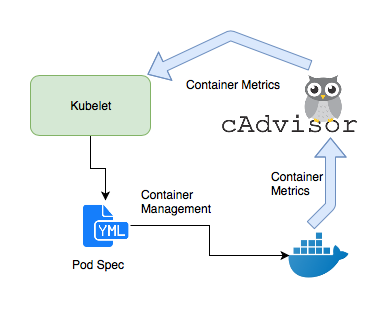
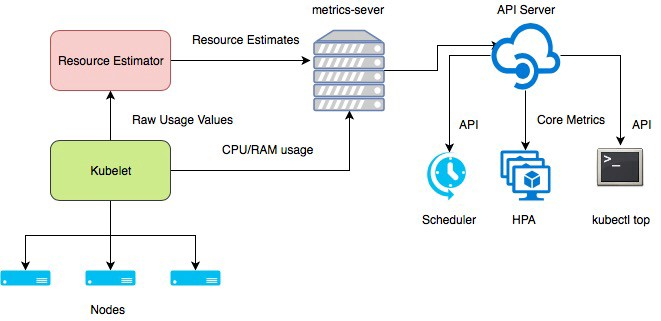

## Monitoring in generic
### Monitoring theory(What/Why)
+ Making the USE method of monitoring useful  
https://www.infoworld.com/article/3638772/making-the-use-method-of-monitoring-useful.html  

+ The RED method: A new strategy for monitoring microservices  
https://www.infoworld.com/article/3638693/the-red-method-a-new-strategy-for-monitoring-microservices.html

+ Monitoring Distributed Systems(The Four Golden Signals)  
https://sre.google/sre-book/monitoring-distributed-systems/

## Kubernetes Monitoring
### Official materials
+ General  
https://github.com/kubernetes/metrics

+ Implementation  
https://github.com/kubernetes/metrics/blob/master/IMPLEMENTATIONS.md  

+ Prometheus Adapter  
https://github.com/kubernetes-sigs/prometheus-adapter  

+ Base library used by Adapter:  
https://github.com/kubernetes-sigs/custom-metrics-apiserver  

### Other materials
+ Kubernetes Metrics  
https://help.sumologic.com/Metrics/Kubernetes_Metrics

+ Introduction to Kubernetes Monitoring Architecture  
https://medium.com/kubernetes-tutorials/introduction-to-kubernetes-monitoring-architecture-98a265e0917d  

Kubelet CAdvisor:  
  

Core monitoring pipeline:  
  

+ Logging and Monitoring Kubernetes
https://www.sumologic.com/blog/kubernetes-logs/  

+ Monitoring Kubernetes: The K8s Anatomy (Crash Course, Part 1)
https://www.sumologic.com/blog/monitoring-kubernetes-anatomy/  

+ Monitoring Kubernetes: What to Monitor (Crash Course, Part 2)
https://www.sumologic.com/blog/kubernetes-monitoring/  

+ Service discovery for ECS
https://github.com/seanly/prometheus-ecs-sd  

+ Effectively Managing Kubernetes Resources with Cost Monitoring
https://medium.com/kubecost/effectively-managing-kubernetes-with-cost-monitoring-96b54464e419  

## Monitoring as Code
https://thenewstack.io/monitoring-as-code-what-it-is-and-why-you-need-it/  
https://www.atlassian.com/incident-management/kpis/common-metrics  